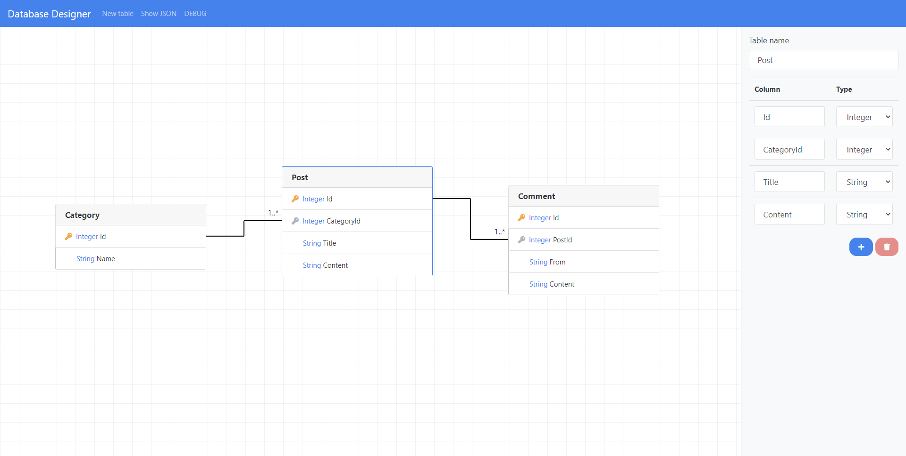

# Blazor.Diagrams

Z.Blazor.Diagrams is a fully customizable and extensible all-purpose diagrams library for Blazor (both Server Side and WASM). It was first inspired by the popular React library [react-diagrams](https://github.com/projectstorm/react-diagrams), but then evolved into something much bigger. ZBD can be used to make advanced diagrams with a custom design. Even the behavior of the library is "hackable" and can be changed to suit your needs. 

| NuGet Package                | Version                                                                                                                                  | Download                                                                                                                                  |
| ---------------------------- | ---------------------------------------------------------------------------------------------------------------------------------------- | ----------------------------------------------------------------------------------------------------------------------------------------- |
| Z.Blazor.Diagrams.Core       |              |              |
| Z.Blazor.Diagrams            |                        |                        |
| Z.Blazor.Diagrams.Algorithms |  |  |

| Badges     |                                                                                                                                                    |
| ---------- | -------------------------------------------------------------------------------------------------------------------------------------------------- |
| JavaScript |          |
| CSS        |              |
| Activity   |  |
| License    |          |

## Mindset/Goals

- **Be multi purpose and useful for most diagramming use cases**. ZBD started as a diagramming library for specific use cases, but it is now expanding to be more generic and more useful.
- **Performance** is very important, especially in WebAssembly.
- **Separate the data layer (models) and the UI layer (widgets)**. Representing diagrams as a model has a lot of benefits, and the separation makes things easier, such as saving snapshots or mutating models, regardless of how/where it's gonna be rendered.
- **Be fully customizable, either in how things look or how things behave**. All of the UI can be customized by either providing Blazor components or using CSS. All of the default behaviors are customizable by replacing them with your own custom behaviors.
- **Avoid JavaScript**. 95% of ZBD is made using C#/Blazor, JS is only used when absolutely necessary (e.g. bounds and observers). JS interop calls are costly, in the future, we strive to have most of them batched and/or replaced.

## Features

- Multi purpose
- Touch support
- SVG layer for links/nodes and HTML layer for nodes for maximum customizability
- Links between nodes, ports and even other links
- Link routers, path generators, markers and labels
- Panning, Zooming and Zooming to fit a set of nodes
- Multi selection, deletion and region selection
- Groups as first class citizen, with all the features of nodes
- Custom nodes, links and groups
- Replaceable ("Hackable") behaviors (e.g. link dragging, model deletion, etc..)
- Customizable Diagram overview/navigator for large diagrams
- Snap to Grid
- Virtualization, only draw nodes that are visible to the users
- Locking mechanism (read-only)
- Algorithms

## Getting Started

You can get started very easily & quickly using:

- [Documentation](https://blazor-diagrams.zhaytam.com/)
- [Installation](https://blazor-diagrams.zhaytam.com/documentation/installation)

### Sample project

Repository: https://github.com/Blazor-Diagrams/Blazor.DatabaseDesigner

### Contributing

All kinds of contributions are welcome!  
If you're interested in helping, please create an issue or comment on an existing one to explain what you will be doing. This is because multiple people can be working on the same problem.

## Feedback

If you find a bug or you want to see a functionality in this library, feel free to open an issue.
