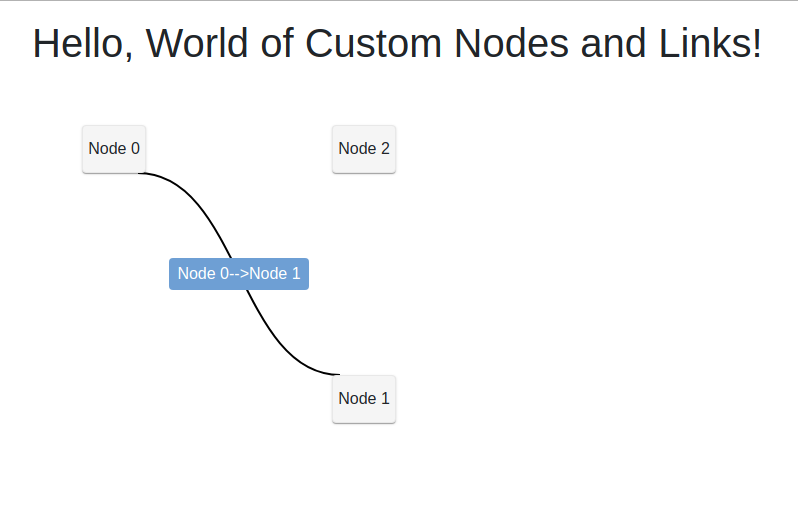

# How to Implement Custom Nodes and Links



## Custom Nodes

* create class (`DiagramNode.cs`) to hold additional information eg `Name`
    * must be derived from `NodeModel`
* create renderer (`DiagramNodeWidget.razor`) to do custom rendering
    * just a _Blazor_ component with a `div` section
    * has reference to a `DiagramNode`
* style as appropriate (`CustomNodesLinks/wwwroot/css/site.css`)
    * _graphml-node_
    * _graphml-selected_
* connect custom node to custom renderer

```csharp
    _diagram.RegisterModelComponent<DiagramNode, DiagramNodeWidget>();
```

## Custom Links aka Link Labels

Slightly more involved as custom rendering is done through a link's label.

For this exercise, we will restrict a link to having exactly one label.

* create class (`DiagramLinkLabel.cs`) which will be custom rendered
    * must be derived from `LinkLabelModel`
* create class (`DiagramLink.cs`) to hold additional information eg `Name`
    * must be derived from `LinkModel`
    * create single `DiagramLinkLabel` in constructor
* create renderer (`DiagramLinkLabelWidget.razor`) to do custom rendering
    * has reference to a `DiagramLinklabel`
* style as appropriate (`CustomNodesLinks/wwwroot/css/site.css`)
    * _graphml-link_
* connect custom node to custom renderer

```csharp
    _diagram.RegisterModelComponent<DiagramLinkLabel, DiagramLinkLabelWidget>();
```
