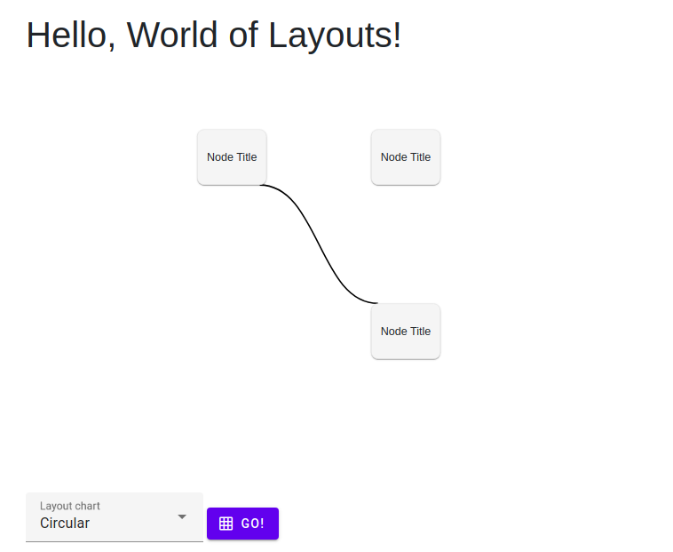

# How to Integrate a Graph Layout Algorithm

## Third-Party Components
[GraphShape](https://github.com/KeRNeLith/GraphShape)
is a .NET library that mainly provide graph layout framework.
It contains several overlap removal and layout algorithms that allow various kind of layouts 
and has also a module with customizable controls for WPF applications visualization.

[QuikGraph](https://github.com/KeRNeLith/QuikGraph)
provides generic directed/undirected graph data structures and algorithms for .NET.

### Optional Components
[MatBlazor](https://github.com/SamProf/MatBlazor)
comprises a range of components which implement common interaction patterns according to the 
Material Design specification.

This is only used to provide some user interface for selecting a layout algorithm.

## Methodology
* convert _Z.Blazor.Diagram_ to _QuikGraph_
* run _GraphShape_ algorithm
* update `NodeModel` positions
